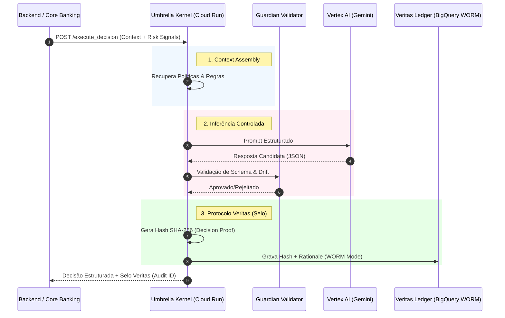

<p align="center">

</p>

<p align="center">
  <a href="#-overview"></a>
  <a href="#-veritas-protocol"></a>
  <a href="#-stack"></a>
  <a href="#-license"></a>
</p>

<h1 align="center">Umbrella Kernel (GCP Edition)</h1>
<h3 align="center">A Primeira Infraestrutura de Confiança Computacional Auditável (ATI)</h3>

<br/>

> **"O modelo é probabilístico. A conformidade deve ser determinística."**

O **Umbrella Kernel** não é apenas um orquestrador de RAG. É uma **camada de decisão auditável** *serverless* projetada para instituições financeiras e ambientes regulados. Ele resolve o *trade-off* fundamental da GenAI corporativa: permitir a agilidade dos LLMs enquanto impõe **Zero-Persistence** de dados sensíveis e gera **prova matemática** de cada decisão.

---

## ⚡ O Problema (Liability Gap)

Implementar GenAI em bancos e seguradoras falha não por falta de inteligência do modelo, mas por **exposição ao risco**:

1. **Alucinação Não-Detectada:** Modelos respondem com confiança, mesmo quando errados.  
2. **Black Box Compliance:** Auditores não conseguem explicar uma decisão probabilística.  
3. **Risco de PII:** Armazenar prompts cria passivo tóxico (LGPD/GDPR).  

---

## 🛡️ A Solução: Umbrella Architecture

Esta implementação de referência (GCP Edition) atua como um *air gap* inteligente entre o backend e a IA.

### Pilares Arquiteturais

1. **Guardian AI (Schema Enforcer):**  
   Nenhuma resposta sai sem validação rígida de estrutura e política.  
   Se o modelo alucina, a transação falha com segurança (*Fail-Safe*).

2. **Protocolo Veritas (Audit Trail):**  
   Cada decisão gera um hash criptográfico (SHA-256) imutável.

3. **Zero-Persistence:**  
   PII é processada apenas em memória volátil.  
   Persistimos apenas a *prova* da decisão (Hash + Rationale) em BigQuery no modo WORM.

---

## 🏗️ Arquitetura Lógica



---

## 🚀 Tech Stack (Google Cloud Native)

- **Compute:** Cloud Run (FastAPI, Python) — *Stateless & Serverless*  
- **Brain:** Vertex AI (Gemini 1.5 Pro / Flash) — *Reasoning Engine*  
- **Memory:** Vertex Vector Search — *High-scale semantic retrieval*  
- **Ledger:** BigQuery WORM — *Immutable Audit Logs*  
- **Tracing:** Cloud Trace + OpenTelemetry — *Observabilidade fim-a-fim*  

---

## 📦 Payload & Protocolo (Exemplo)

**Request (Core Banking):**

```json
{
  "transaction_id": "tx_998877",
  "context": "User attempting withdrawal > daily limit",
  "policy_set": "fraud_prevention_v2"
}
```

**Response (Umbrella Kernel):**

```json
{
  "decision": "BLOCK",
  "rationale": "Transaction exceeds daily limit of $5k defined in policy v2.",
  "next_action": "trigger_2fa",
  "veritas_seal": {
    "hash": "e3b0c44298fc1c149afbf4c8996fb92427ae41e4649b934ca495991b7852b855",
    "timestamp": "2025-11-15T14:30:00Z",
    "ledger_ref": "bq://audit_logs/row_8821"
  }
}
```

---

## 🛠️ Deploy (Terraform)

```bash
# 1. Configurar credenciais
gcloud auth application-default login

# 2. Inicializar e aplicar
cd terraform/
terraform init
terraform apply -var="project_id=seu-projeto-gcp"
```

### Variáveis Principais

| Variável | Descrição |
|---------|-----------|
| `veritas_mode` | Ativa modo WORM (imutabilidade legal). |
| `guardian_strictness` | Rigor do schema (default: HIGH). |
| `region` | Região de processamento (Residência de Dados). |

---

## ⚖️ Liability Shift

Ao usar o **Umbrella Kernel**, a responsabilidade pela consistência da IA migra da aplicação para a infraestrutura.

- **Para CISO:** proteção contra prompt injection e deriva.  
- **Para DPO:** Zero-Persistence → nenhum PII armazenado.  
- **Para Reguladores:** trilha de auditoria determinística.  

---

<p align="center">
Construído pela <strong>FoundLab</strong>.<br/>
<em>Building the Trust Layer for the AI Era.</em>
</p>
